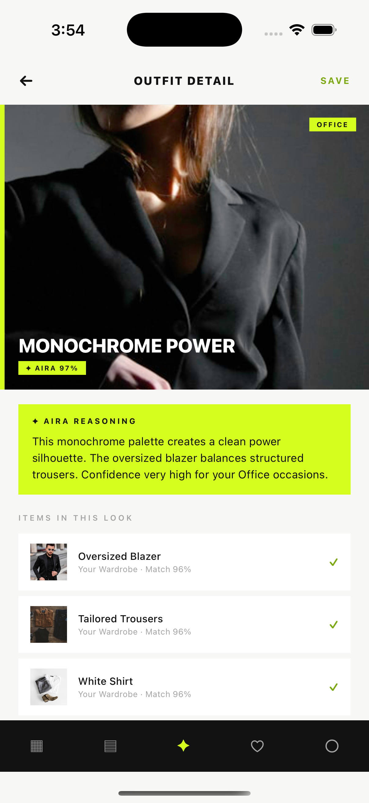
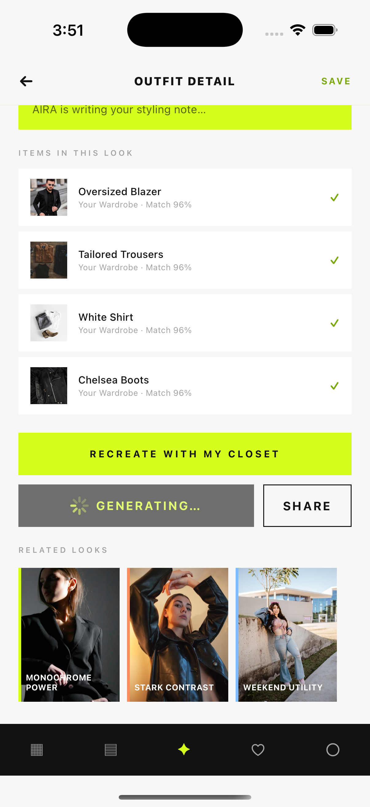
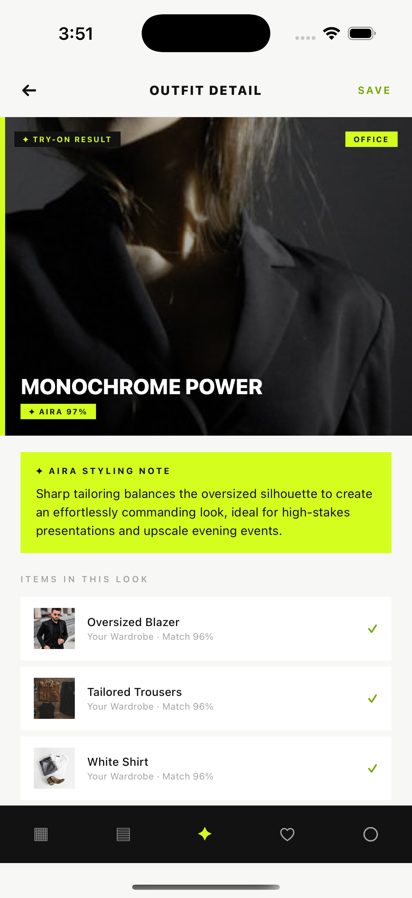
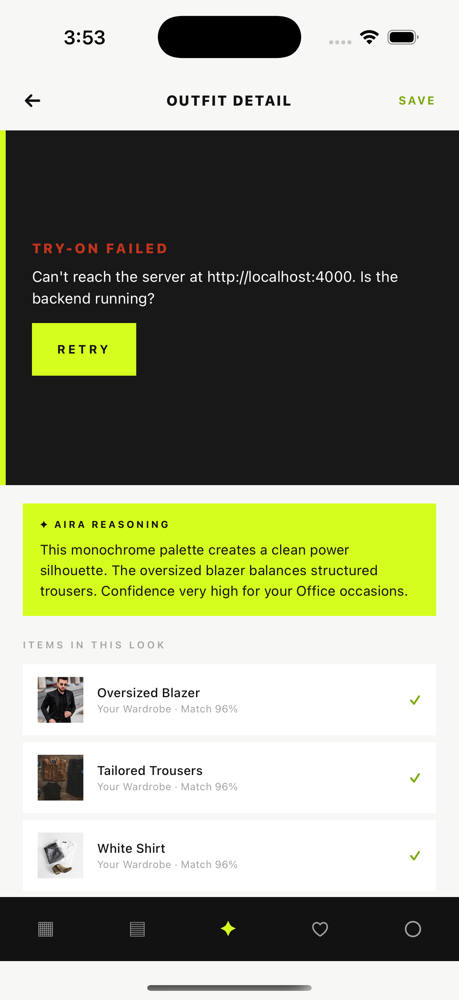

# Attira — Virtual Try-On (Engineering Intern Task)

Recreation of the **Outfit Detail** screen from the supplied Figma board in
**React Native CLI + TypeScript**, with the primary CTA wired to a small
**Express + TypeScript** backend that calls **Google Gemini** for a one-sentence
styling note and returns a mock result image.

| Part | Stack | Location |
| --- | --- | --- |
| Mobile app | React Native 0.87 CLI, TypeScript, Redux Toolkit + RTK Query, redux-persist | [`mobile/`](mobile/) |
| Backend | Node, Express 4, TypeScript, `@google/generative-ai` | [`backend/`](backend/) |

### Screenshots (running on iOS simulator, real Gemini call)

| Initial | Loading | Success | Error |
| --- | --- | --- | --- |
|  |  |  |  |

Reference Figma export: [`_figma/outfitdetail.png`](_figma/outfitdetail.png)

---

## Screen chosen

`OutfitDetailScreen` — "Monochrome Power". It has a hero image, an **AIRA
REASONING** note box, an items list, and a primary CTA. The CTA is the task's
**"Generate Try-On"** action:

- **initial** – hero shows the outfit image, note box shows static reasoning, button reads `GENERATE TRY-ON`
- **loading** – button shows a spinner, stage shows a "Generating…" overlay
- **success** – hero swaps to the backend result image, note box fills with the Gemini styling note, button reads `TRY ON AGAIN`. The last result is persisted (redux-persist / AsyncStorage) and restored on relaunch.
- **error** – stage shows an inline error with a Retry action; message is derived from the backend's JSON error (network / timeout / missing key / upstream)

---

## Backend

### `POST /api/try-on`

Request:

```json
{ "outfitName": "Monochrome Power — oversized blazer, tailored trousers, white shirt" }
```

Success `200`:

```json
{
  "status": "completed",
  "resultImageUrl": "http://localhost:4000/static/mock-result.jpg?v=1788344468251",
  "styleNote": "Sharp tailoring balances the oversized silhouette to create an effortlessly commanding look..."
}
```

Failure — always non-2xx + JSON:

| Status | `code` | When |
| --- | --- | --- |
| `400` | `INVALID_REQUEST` | `outfitName` missing / not a non-empty string |
| `500` | `MISSING_API_KEY` | `GEMINI_API_KEY` not set on the server |
| `502` | `UPSTREAM_ERROR` | Gemini call failed or returned nothing |
| `500` | `INTERNAL_ERROR` | anything else |

- `GEMINI_API_KEY` is read server-side only (`backend/.env`) and never sent to the client.
- The result image is a bundled static asset served from `backend/public/` — no image generation, per the task's mock-result note. A `?v=<timestamp>` cache-buster is appended so a repeated try-on always re-renders.
- Model is configurable via `GEMINI_MODEL` (default `gemini-3.6-flash`).
- `GET /health` → `{ "status": "ok", "geminiConfigured": true|false }`

### Run

```bash
cd backend
npm install
cp .env.example .env        # then paste your real GEMINI_API_KEY
npm run dev                  # http://localhost:4000
```

---

## Mobile app

### Run (iOS)

```bash
cd mobile
npm install
bundle install && bundle exec pod install --project-directory=ios
npm start                    # Metro, separate terminal
npm run ios                  # builds & launches the iOS simulator
```

Android: `npm run android` (emulator reaches the host on `10.0.2.2`, already
handled in `src/shared/config/index.ts`).

### Backend URL

`mobile/src/shared/config/index.ts` picks `http://localhost:4000` (iOS sim) or
`http://10.0.2.2:4000` (Android emulator). For a physical device set
`API_BASE_URL_OVERRIDE` there to your machine's LAN IP and set `PUBLIC_BASE_URL`
in `backend/.env` to the same host.

### Tests

```bash
cd mobile && npm test        # slice + API-error-mapping + render tests
cd backend && npm run typecheck
```

---

## Project layout (mobile)

Feature-first: `src/features/<feature>/{api,hooks,model,components,screens}`,
with `src/shared` for theme / config / reusable UI and `src/app` for the store.

```
mobile/src/
  app/                  redux store, typed hooks, providers
  shared/               theme tokens, runtime config, AppButton / Tag
  features/
    outfit/             static outfit content + item / related-look rows
    tryOn/
      api/              RTK Query endpoint + error → TryOnFailure mapping
      hooks/            useGenerateTryOn — owns the initial/loading/success/error phase
      model/            slice (persisted last result), selectors, types
      components/       TryOnStage, StylingNote
      screens/          OutfitDetailScreen
```

---

## Notes / trade-offs (60-min task)

- **Mock result image** is bundled, matching the task's "return the supplied
  mock result" instruction — the interesting async path (Gemini call, phased UI,
  error handling, persistence) is the focus.
- Redux Toolkit + RTK Query is heavier than needed for one endpoint, but gives
  request lifecycle state, caching and a clean error boundary for free.
- Figma assets were exported via the Figma REST API and committed under
  `mobile/src/assets/` and `_figma/`.
- No secrets are committed — see `.env.example` files; real `.env` is gitignored.
